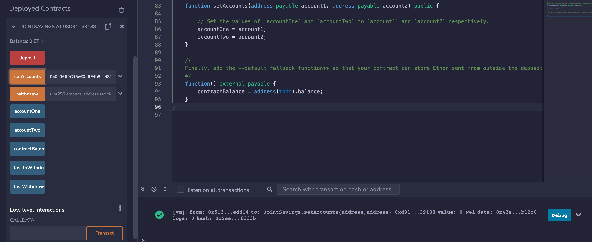
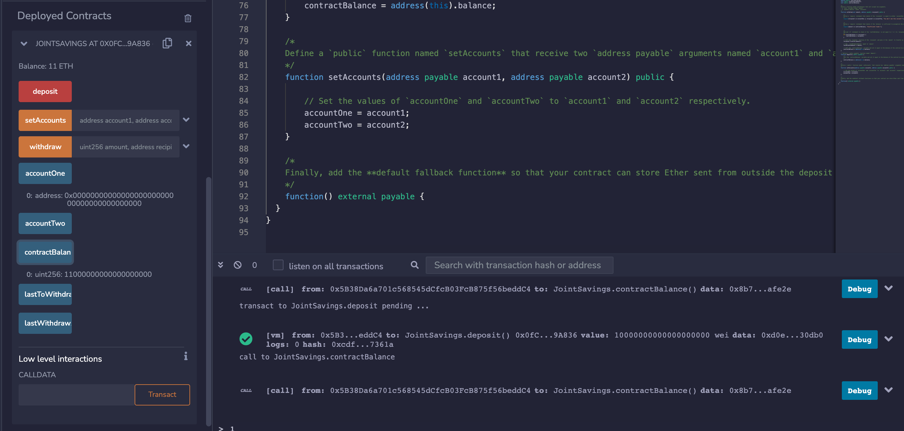
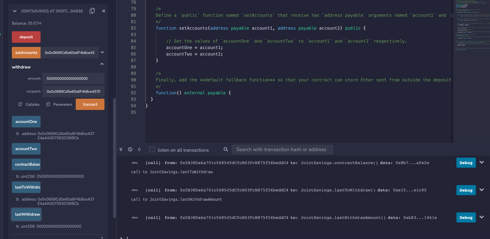

# Module_20

* Here are my pictures, which can be found in the Pictures folder and i did include my solidity file.

* Setting the accounts:

* Adding 1 ether in wei:

* Adding 10 ether in wei:

* Adding 5 ether:

* Transferring 5 ether in wei to address1:

* Transferring 10 ether in wei to address2:

